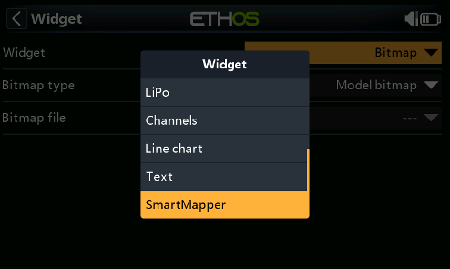
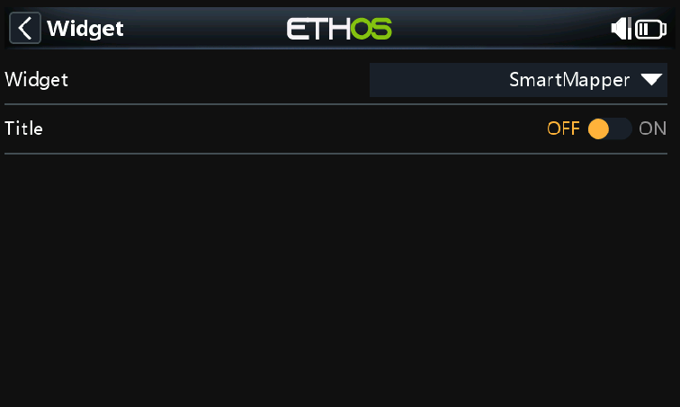
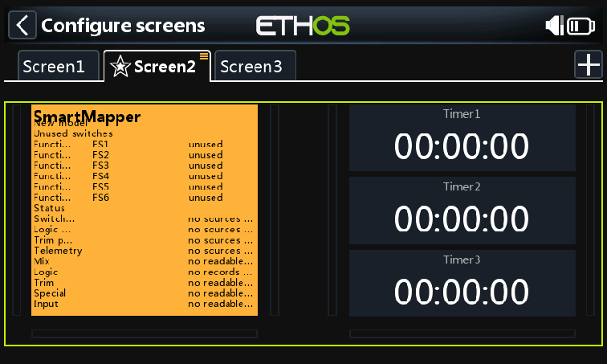

# SmartMapper User Guide

SmartMapper is a fullscreen Ethos widget that summarizes the control sources
and model assignments that Lua can read safely. It is read-only: it does not
create, edit, or delete model configuration.

The screenshots in this guide were captured from the repository GUI simulator
harness with the `SmartMapper-X20RS-FCC` suite on Ethos `26.1.0-RC2`.

## Install SmartMapper

Build or deploy SmartMapper from the repository root:

```powershell
python tools/build.py --project SmartMapper --dist
python tools/build.py --project SmartMapper --deploy
```

Install the generated ZIP through Ethos Suite, or use the deploy command when
your local simulator path is configured.

## Add The Widget

1. Open the model screen configuration page on the radio or simulator.
2. Tap the screen zone where SmartMapper should appear.
3. Open the `Widget` selector.
4. Scroll to `SmartMapper` and select it.



After selection, the widget settings page should show `SmartMapper` as the
widget type. SmartMapper draws its own title, so turning the Ethos `Title`
setting off gives the clearest layout in smaller zones.



Return to the screen configuration view to confirm that the widget paints.



## Read The Display

SmartMapper builds the display in sections:

- `Assigned controls`: controls that appear in readable mixes, logical
  switches, trims, special functions, inputs, or channels.
- `Unused switches`: switch-like sources found in the source inventory that do
  not appear in readable assignments.
- `Status`: API surfaces that were unavailable, empty, or not readable in the
  current runtime/model.

Simulator default models often expose few real assignments. A configured radio
model with mixes, logical switches, special functions, or inputs should show
more useful assigned rows when those APIs are readable from Lua.

## Refresh And Scroll

- Use touch-drag, mouse wheel, or the radio rotary control to scroll when the
  list is longer than the zone.
- Press enter on the widget to request a manual refresh.
- SmartMapper also performs periodic lightweight polling and occasional deeper
  rescans while the widget is active.

## Troubleshooting

- If SmartMapper does not appear in the widget picker, confirm that
  `scripts/SmartMapper/main.lua` is installed under the selected radio or
  simulator profile.
- If `Status` rows say a surface has no readable API, that surface is not
  exposed by the current Ethos runtime or model through the Lua functions that
  SmartMapper can safely call.
- If only unused switches appear, open a configured model with readable
  assignments and refresh the widget.

## Simulator Capture Command

The screenshots above were captured after launching the GUI harness:

```powershell
python tools/sim/harness/run.py gui --suite tools/sim/harness/suites/SmartMapper-X20RS-FCC.json --no-open
```

For repeatable local capture work, use `--run-dir` and `--persist-dir` to keep
the staged simulator files under a disposable run directory.
