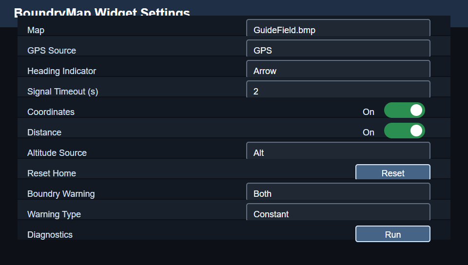
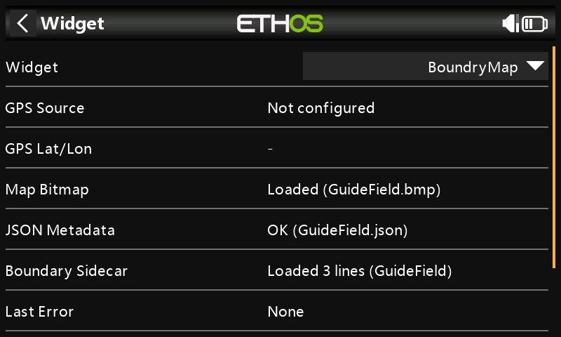
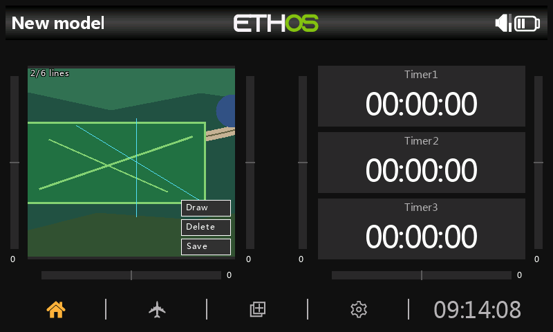
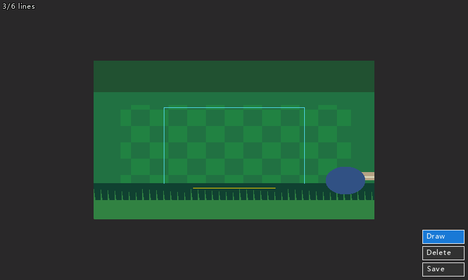
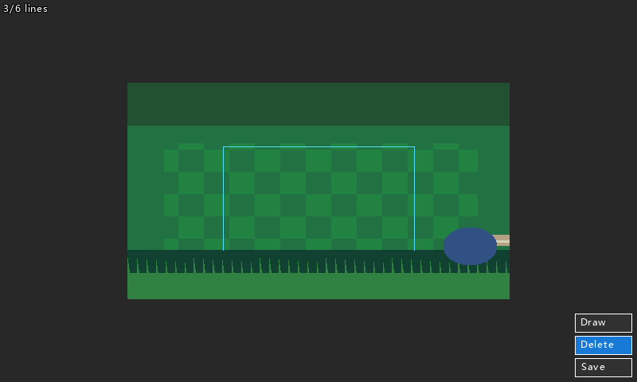
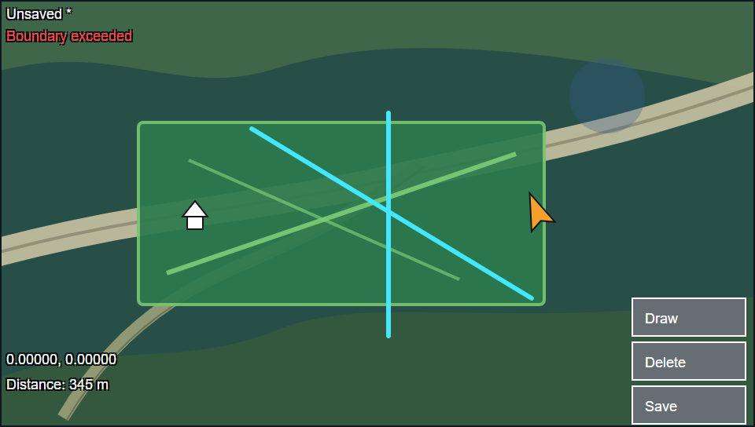

# BoundryMap

BoundryMap is an Ethos widget for flying with a GPS map and editable boundary
lines. It shows your home point, aircraft position, optional coordinates and
distance, and warns when a boundary is crossed or lies directly ahead on the
current flight path.

The screenshots below were captured from the actual Ethos 1.6.6 X20RS-FCC
WebSimulator canvas using a neutral demo map named `GuideField`, so no private
flying-site map or real field coordinates are published in this repository.
The map views use Ethos' `Full screen` layout and a three-sided, non-crossing
demo boundary. The boundary-warning screenshot uses a run-scoped simulated GPS
state because the stock simulator model used for capture does not expose a GPS
telemetry source.

## Quick Start

1. Create a map with the
   [Ethos GPS Map Generator](https://martinovem.github.io/Ethos-GPS-Map-Generator/).
2. Put the exported bitmap and JSON metadata in a local folder under
   `scripts/BoundryMap/assets/maps/`.
3. Build the install ZIP:

   ```powershell
   python tools/build.py --project BoundryMap --dist
   ```

4. Import the generated ZIP with Ethos Suite.
5. Add the `BoundryMap` widget to a screen.
6. Open the widget settings, choose your map and GPS source, then enable the
   options you want.

## Map Files

BoundryMap expects each map bitmap to have a matching JSON metadata file with
the same stem:

```text
scripts/BoundryMap/assets/maps/
├── MyField/
│   ├── MyField.bmp
│   └── MyField.json
└── PracticeSite/
    ├── PracticeSite.png
    └── PracticeSite.json
```

The build scans `assets/maps/` automatically:

- BMP and PNG map files install to `/scripts/BoundryMap/assets/maps/`.
- matching JSON metadata files install to the same radio folder.
- generator text metadata is not packaged because the widget reads the JSON.
- boundary sidecars are saved as `<map-stem>.boundries.json`.

Maps usually identify a specific flying site. The local map folders are ignored
by Git; do not commit personal maps, generated metadata, or boundary sidecars
to the public repository.

## Widget Settings



Use the widget settings to choose the map and tune how the in-flight overlay
behaves.

| Setting | Use |
| --- | --- |
| `Map` | Select the packaged bitmap map file. |
| `GPS Source` | Select the GPS telemetry source used for latitude and longitude. |
| `Heading Indicator` | Choose `Dot` or `Arrow` for the aircraft marker. |
| `Signal Timeout (s)` | Mark GPS data stale after this many seconds without a fresh fix. |
| `Coordinates` | Show or hide the current GPS coordinates on the map. |
| `Distance` | Show or hide distance readouts. Without altitude, this is 2D ground distance. |
| `Altitude Source` | Optional altitude telemetry source for 3D distance. |
| `Reset Home` | Clear the learned home point so the widget can learn it again. |
| `Boundry Warning` | Choose `None`, `Audio`, `Haptic`, or `Both`. |
| `Warning Type` | Choose one-time `Momentary` feedback or repeating `Constant` feedback. |
| `Speed Source` | Optional ground-speed or airspeed telemetry source used for predictive warnings. |
| `Pre-warning Time` | Keep prediction `Off`, or warn when the projected path reaches a boundary in 1 to 10 seconds. |
| `Diagnostics` | Open a status page for GPS, map, metadata, sidecar, and last error. |

## Diagnostics



Run diagnostics when the widget is not showing the map or telemetry you expect.
The diagnostics page checks:

- GPS source selection and current latitude/longitude availability.
- selected map bitmap availability.
- JSON metadata availability and shape.
- boundary sidecar availability and line count.
- the last runtime error captured by the widget.

Use `Back` to return to the main settings page.

## In-Flight Display



The map screen shows the selected map and boundary lines. With GPS telemetry,
it also shows the home icon and aircraft indicator. The lower-left overlays
show coordinates and distance when those settings are enabled. The top-left
status shows how many boundary lines are on the map out of the six-line limit,
or `Unsaved *` when changes need to be saved.

Home is learned from stable GPS telemetry. If the home point is wrong, use
`Reset Home` in the settings page, wait for a stable GPS fix, and verify the
home icon appears where expected.

If GPS telemetry becomes stale for longer than `Signal Timeout (s)`, the
aircraft indicator switches to the stale style and the widget keeps the last
known 2D ground distance visible. The normal live distance can still use the
optional altitude source to show 3D slant distance.

## Drawing Boundaries



Tap `Draw` to enter draw mode. Drag on the map from the start of a boundary
line to the end of it. The draft line is yellow while you are drawing. When you
release, the line is added and the status changes to `Unsaved *`.

BoundryMap stores up to six boundary lines per map. Short accidental drags are
ignored.

## Deleting And Saving



Tap `Delete` to enter delete mode, then tap near a boundary line to remove it.
Tap `Save` after adding or deleting lines. Saved boundaries are written next to
the selected map as `<map-stem>.boundries.json`, so each map keeps its own
boundary set.

Unsaved edits remain visible while the widget is running, but they are not
persisted until you tap `Save`.

## Boundary Warnings



The red `Boundary exceeded` overlay appears when the line from home to the
aircraft crosses one of the current boundary lines. When `Speed Source` and a
1-to-10-second `Pre-warning Time` are configured, a yellow `Boundary ahead`
overlay appears when the current heading and speed project an outbound crossing
within that time. Unsaved edits can trigger warnings while the widget is
running, but they must be saved to persist after restart. Warning feedback
depends on the settings:

- `None`: show the overlay only.
- `Audio`: play tone feedback.
- `Haptic`: play haptic feedback.
- `Both`: play tone and haptic feedback.
- `Momentary`: alert once when first entering an ahead or exceeded state while
  moving away from home.
- `Constant`: repeat feedback while the ahead or exceeded state remains active.

Predictive warnings require fresh GPS and speed telemetry plus a heading derived
from recent GPS movement. GPS ground speed is usually the best source for the
projected ground track. Airspeed is supported, but wind can make an airspeed-only
projection differ from the actual ground path. A turn after the last GPS heading
update can also briefly make the projection lag the aircraft.

For best results, keep boundary sets simple and non-crossing. A three-sided box
is a practical default when you want a readable keep-out shape without closing a
full perimeter. Closing the shape is optional, but it does not enable polygon
containment; the widget still compares the home-to-aircraft line against each
saved segment independently.

## Troubleshooting

| Symptom | Check |
| --- | --- |
| `No map selected` | Select a map in the widget settings. |
| `Map metadata unavailable` | Confirm the bitmap and JSON metadata have the same file stem. |
| GPS coordinates do not update | Run diagnostics and confirm the selected GPS source reports latitude and longitude. |
| Distance is hidden | Enable `Distance`; select an altitude source only when you want 3D distance. |
| Boundary edits disappear after restart | Draw or delete the lines again, then tap `Save`. |
| No warning feedback | Confirm `Boundry Warning` is not `None` and the aircraft is moving farther from home when entering the exceeded state. |
| No predictive warning | Select a supported speed source, choose a 1-to-10-second pre-warning time, and confirm both GPS and speed telemetry are fresh. |

## Attribution

Map handling is derived from
[AccuMap](https://github.com/MartinovEm/Ethos-GPS-AccuMap). See
[LICENSE](LICENSE) for BoundryMap licensing details.
